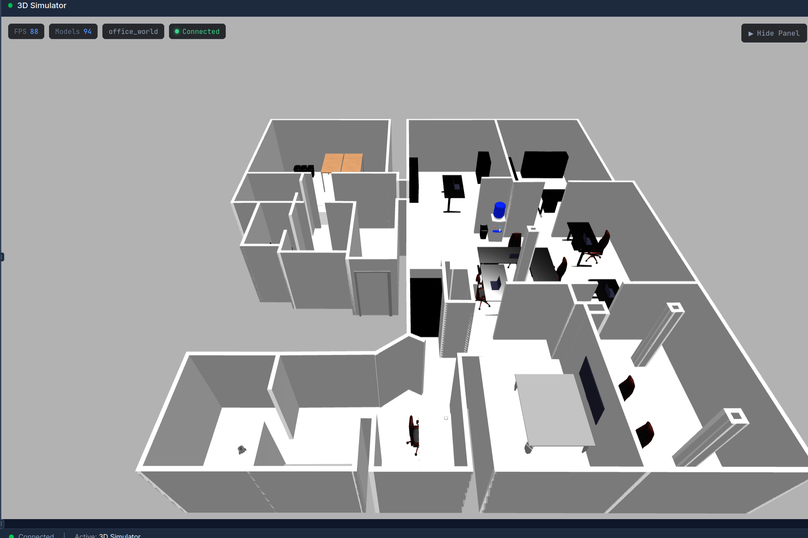
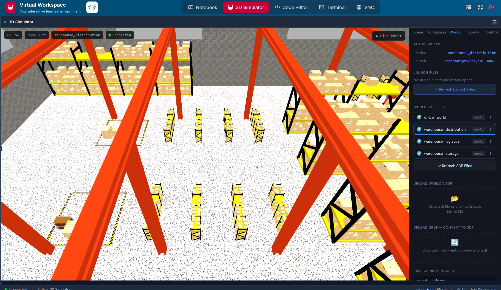
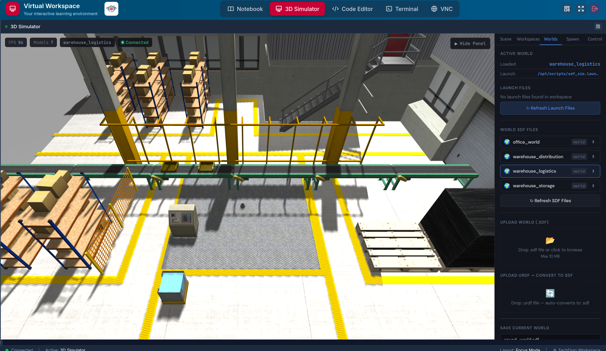
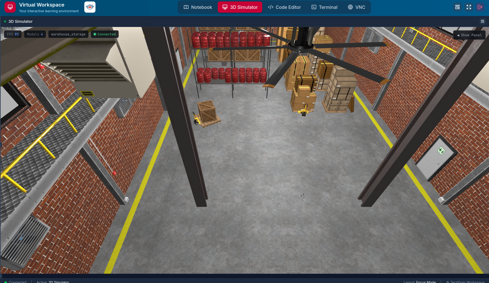

# Gazebo Worlds Repository

This repository contains a collection of Gazebo simulation worlds used for robotics development and testing.Currently, the repository includes **4 worlds**, and it will be updated as new worlds are added in the future.

---

## 📁 Repository Structure

```
Gazebo_worlds/
├── office_world/
│   └── launch/
│       └── office_world_launch.py
│
└── warehouse_worlds/
└── launch/
├── warehouse_distribution_launch.py
├── warehouse_logistics_launch.py
└── warehouse_storage_launch.py
```

---

### 📥 First step: Clone the repository

```bash
git clone https://github.com/ETGAH/Gazebo_worlds.git
```

Then move into the workspace:

```bash
cd Gazebo_worlds
```

### 🛠️ Build and source the workspace

After cloning the repository, go into your ROS 2 workspace and build it:

```bash
cd ~/etgah_ws
colcon build
```

---

### 🔗 Source the workspace

After a successful build, source your workspace:

```bash
source install/setup.bash
```

---


## 🚀 How to Run

### 🏢 Run Office World

To launch the office simulation world:

```bash
ros2 launch office_world office_world_launch.launch.py
```



### 🏭 Run Warehouse Worlds

The warehouse package includes 3 different simulation environments. You can run each one separately:

#### 1. Distribution Warehouse

```bash
ros2 launch warehouse_worlds warehouse_distribution_launch.launch.py
```



#### 2. Logistics Warehouse

```bash
ros2 launch warehouse_worlds warehouse_logistics_launch.launch.py
```



#### 3. Storage Warehouse

```bash
ros2 launch warehouse_worlds warehouse_storage_launch.launch.py
```



---
